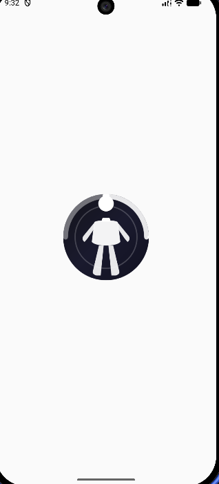
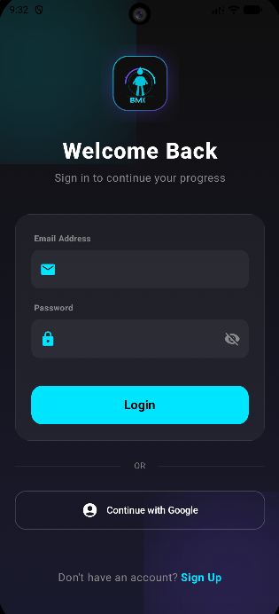
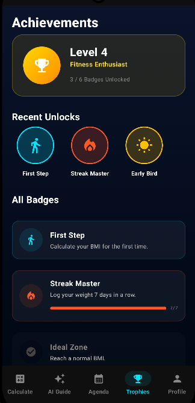

# 🧮 BMI Calculator & AI Fitness Guide

# 🧮 BMI Calculator - AI Fitness & Health App

Aplikasi **BMI Calculator & AI Fitness Guide** adalah aplikasi mobile modern yang membantu pengguna menghitung BMI, mengatur pola makan sehat, membuat agenda olahraga, dan memantau perkembangan kesehatan tubuh secara interaktif.

BMI Calculator adalah aplikasi fitness digital dengan tampilan futuristik dark mode yang dirancang untuk membantu pengguna menjaga kesehatan dan mencapai target body goals dengan lebih terstruktur.

---

## 🚀 Fitur Utama

* Tampilan Splash Screen Modern
* Login & Authentication User
* BMI Calculator Interaktif
* AI Meal Planner
* Agenda & Target Olahraga
* Achievement & Trophy System
* Profile & Progress Tracker

- 🚪 Splash Screen (Loading Screen)
- 🔐 Login & Authentication
- 📊 BMI Calculator
- 🤖 AI Meal Planner
- 🏃 Workout Agenda
- 🏆 Achievement System
- 👤 User Profile

---

# 📸 Tampilan Aplikasi

## 1. 🚪 Splash Screen

Tampilan awal saat aplikasi dibuka.



---

## 2. 🔐 Login / Authentication

Halaman autentikasi pengguna sebelum masuk ke aplikasi.



---

## 3. 📊 BMI Calculator

Fitur untuk menghitung BMI berdasarkan tinggi badan, berat badan, dan gender pengguna.


---

## 4. 🤖 AI Meal Planner

Fitur AI yang membantu pengguna menentukan pola makan sesuai tujuan fitness.

### 🔥 Weight Loss Mode


### ⚖️ Maintain Weight Mode

.png)

### 💪 Weight Gain Mode

.png)

---

## 5. 🏃 Agenda & Target Olahraga

Fitur agenda olahraga berdasarkan tingkat kesulitan latihan.

### 🟢 Easy Workout


### 🟠 Medium Workout


### 🔴 Extreme Workout


---

## 6. 🏆 Achievement & Trophy System

Sistem pencapaian dan badge untuk meningkatkan motivasi pengguna.



---

## 7. 👤 User Profile

Halaman profil pengguna untuk memantau perkembangan kesehatan dan target berat badan.


---

# 🛠️ Teknologi yang Digunakan

* Android Studio
* Flutter / React Native
* Dart / JavaScript
* Firebase Authentication
* Firebase Firestore / SQLite
* Material UI

---

# 📌 Catatan Penting

* Gunakan `%20` untuk spasi pada nama file gambar agar tidak error di GitHub
* Pastikan semua file gambar sudah di-upload ke repository
* Contoh:

```bash
git add .
git commit -m "add project images"
git push
```

---

# 📂 Struktur Folder (Rekomendasi)

```bash
BMI-Calculator-App/
│── loading page jpg(1).png
│── proses registrasi(1).png
│── fitur calculate.png
│── AI Planner Meal.png
│── AI Planner Meal (2).png
│── AI Planner Meal (3).png
│── Agenda Target Olahraga.png
│── Agenda Target Olahraga 2.png
│── Agenda Target Olahraga 3.png
│── Pencapaian.png
│── Profile apk.png
│── README.md
```

---

# 💡 Tips

Kalau ingin lebih rapi, pindahkan semua gambar ke folder `images/`, lalu ubah format gambar menjadi:

```md

```

---

# 🎯 Tujuan Aplikasi

Aplikasi ini dibuat untuk membantu pengguna:

* Menghitung BMI dengan cepat
* Mengatur pola makan sehat
* Menjaga konsistensi olahraga
* Memantau progress kesehatan
* Meningkatkan motivasi fitness melalui achievement system

---

# 👨‍💻 Developer

Developed by **Your Name**

---

# 📄 License

```txt
MIT License

Copyright (c) 2026

Permission is hereby granted, free of charge, to any person obtaining a copy
of this software and associated documentation files.
```
